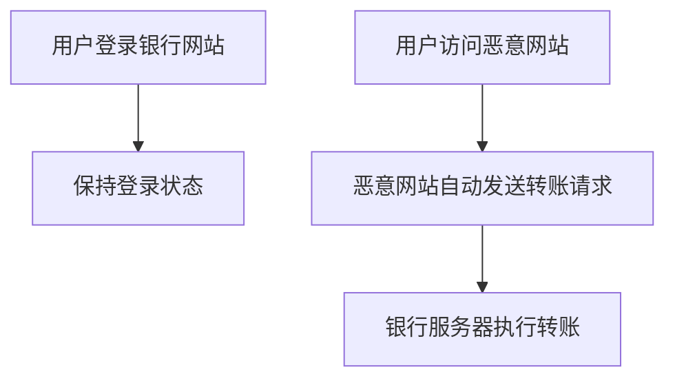

## 目录
1. [漏洞定义与原理](#漏洞定义与原理)
2. [与XSS的区别](#与xss的区别)
3. [攻击场景与案例](#攻击场景与案例)
4. [漏洞挖掘方法](#漏洞挖掘方法)
5. [防御方案](#防御方案)
6. [法律声明](#法律声明)

---

## 漏洞定义与原理
### 核心概念
**CSRF（Cross-Site Request Forgery）**  
攻击者诱导用户在已认证的Web应用中执行非预期操作。利用用户浏览器中已存储的Cookie/Session，伪造合法用户的请求。

### 攻击条件
- 用户已登录目标网站
- 攻击者可预测请求参数
- 目标网站未采用有效的CSRF防护措施

### 攻击流程


---

## 与XSS的区别
| **维度**       | **CSRF**                          | **XSS**                          |
|----------------|-----------------------------------|----------------------------------|
| 攻击目标        | 伪造用户操作（如转账、改密）       | 窃取用户数据/会话                |
| 是否需要交互    | 用户需访问恶意页面                 | 用户访问被注入恶意脚本的页面      |
| Cookie利用     | 利用已存在的Cookie                | 窃取Cookie后使用                 |
| 第三方网站角色  | 必须存在第三方恶意站点             | 可在同站点内触发                 |

---

## 攻击场景与案例
### 典型攻击方式
#### 1. 图片标签自动触发
```html

```

#### 2. 隐藏表单自动提交
```html
<form action="http://bank.com/transfer" method="POST">
  <input type="hidden" name="to" value="hacker">
  <input type="hidden" name="amount" value="1000">
</form>
<script>document.forms[0].submit();</script>
```

#### 3. 诱导点击链接
```html
<a href="http://bank.com/transfer?to=hacker&amount=1000">
  点击领取红包！<!-- 用户点击后触发转账 -->
</a>
```

### 真实案例
- **Gmail历史漏洞**：通过CSRF修改邮件转发规则，窃取用户邮件
- **社交平台蠕虫传播**：伪造“点赞”请求实现自动化传播

---

## 漏洞挖掘方法
### 检测流程
1. **接口识别**：抓取关键操作请求（如修改密码、转账）
2. **请求重放**：移除Cookie后重放请求，观察是否成功
3. **PoC构造**：验证是否可跨域触发请求

### 工具支持
| **工具**       | **功能**                                 | **链接**                              |
|----------------|----------------------------------------|--------------------------------------|
| Burp Suite     | 生成CSRF PoC，模拟跨站请求               | 内置`Engagement Tools > Generate CSRF PoC` |
| CSRF-Faster    | 自动化检测CSRF漏洞                       | [GitHub](https://github.com/s0md3v/Bolt)   |
| WVS            | 全站扫描包含CSRF检测模块                 | 商业工具                             |

---

## 防御方案
### 1. Token验证机制
- **实现方式**：服务端生成唯一Token，嵌入表单或请求头
- **代码示例**：
  ```php
  // 生成Token
  $_SESSION['csrf_token'] = bin2hex(random_bytes(32));
  // 表单中嵌入
  <input type="hidden" name="csrf_token" value="<?= $_SESSION['csrf_token'] ?>">
  ```

### 2. Referer检查
- **规则**：验证请求来源是否为合法域名
- **局限性**：Referer可能被篡改或缺失

### 3. 验证码/二次确认
- **适用场景**：敏感操作（如支付、改密）
- **实现方式**：短信验证码、邮箱确认链接

### 4. 浏览器安全策略
- **SameSite Cookie**：设置Cookie的SameSite属性为`Strict`或`Lax`
  ```php
  setcookie("sessionid", "xxx", ["samesite" => "Strict"]);
  ```

### 5. 关键操作限制
- **POST请求限制**：强制使用POST进行敏感操作
- **自定义Header**：校验请求头中的自定义字段（如`X-Requested-By`）

---

## 法律声明
> **《中华人民共和国网络安全法》第二十七条**  
> 任何个人和组织不得从事非法侵入他人网络、干扰他人网络正常功能、窃取网络数据等危害网络安全的活动；不得提供专门用于从事侵入网络、干扰网络正常功能及防护措施、窃取网络数据等危害网络安全活动的程序、工具；明知他人从事危害网络安全的活动的，不得为其提供技术支持、广告推广、支付结算等帮助。  
> **本文档内容仅用于安全研究与防御技术学习，严禁用于非法用途！**
```