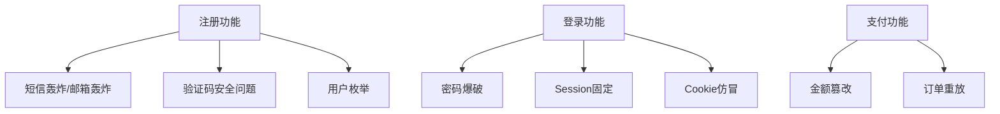

## 目录
1. [身份验证漏洞](#身份验证漏洞)
2. [登录验证安全](#登录验证安全)
3. [登录前端验证漏洞](#登录前端验证漏洞)
4. [任意账号注册漏洞](#任意账号注册漏洞)
5. [权限类漏洞](#权限类漏洞)
6. [其他类型漏洞](#其他类型漏洞)
7. [SRC逻辑漏洞检查总结](#src逻辑漏洞检查总结)
8. [法律声明](#法律声明)

---

## 身份验证漏洞

### 1. 暴力破解漏洞
| **类型**                | **攻击方式**                                                                 | **案例**                                  |
|-------------------------|----------------------------------------------------------------------------|------------------------------------------|
| 未限制爆破              | 使用Burp Suite直接爆破账号密码                                               | DVWA、Pikachu靶场《基于表单的暴力破解》     |
| 限制IP爆破              | 使用代理池或轮子脚本绕过IP封锁                                               | 调用代理API进行分布式爆破                 |
| 限制密码错误次数        | 固定弱密码反向爆破账号                                                       | 使用`123456`爆破用户名                    |
| 多字段爆破              | Intruder模块多参数组合爆破                                                   | Pikachu Token爆破                         |
| 限制登录频率            | 设置延时爆破（如1000ms/次）                                                  | Burp Suite配置时间间隔                   |
| Authorization爆破       | Base64编码爆破（如Tomcat后台）                                               | Vulhub Tomcat8环境爆破                   |
| 密文传输爆破            | 逆向JS加密逻辑或使用`pyexecjs`执行加密                                        | MD5/RSA加密密码爆破                       |

### 2. Session固定攻击
- **原理**：利用服务器Session不变机制，诱导用户使用攻击者预设的Session登录  
- **场景**：GET请求携带Session参数（如`login?sessionid=xxx`）  
- **检测**：复制Session至无痕浏览器访问，无需登录即存在漏洞  
- **修复**：禁用URL携带Session，登录后重置Session  

### 3. Cookie欺骗漏洞
- **特征**：Cookie明文存储身份信息（如`Cookie: user=admin`）  
- **攻击**：伪造Cookie字段（如`isLogin=1`）绕过验证  
- **案例**：某网站Cookie值为用户ID，直接修改即可越权  

### 4. 未授权访问
- **场景**：后台路径直接访问（如`/admin/main.php`）、敏感接口无鉴权  
- **案例**：某航天公司订单ID枚举导致数据泄露  

---

## 登录验证安全

### 图形验证码漏洞
| **类型**          | **攻击方式**                                                                 | **修复方案**                             |
|-------------------|----------------------------------------------------------------------------|----------------------------------------|
| 验证码可爆破      | PKAV工具爆破简单验证码                                                       | 增加干扰元素，限制验证码位数（≥6位）      |
| 验证码复用        | 使用历史验证码重复提交                                                       | 登录失败后强制刷新验证码                 |
| 验证码绕过        | 修改返回包状态值（如`{"status":"success"}`）                                 | 服务端校验逻辑与前端显示分离             |
| 客户端验证        | 直接抓包绕过前端验证                                                         | 前后端双重校验                           |

### 短信验证码漏洞
| **类型**          | **攻击方式**                                                                 | **修复方案**                             |
|-------------------|----------------------------------------------------------------------------|----------------------------------------|
| 无效验证          | 不校验验证码直接提交                                                         | 强制验证码与服务端逻辑绑定               |
| 短信轰炸          | Intruder重放短信接口                                                         | 限制IP/手机号发送频率（如60秒/条）       |
| 验证码回显        | 返回包中包含明文验证码                                                       | 验证码仅存储于服务端                     |

---

## 登录前端验证漏洞

### 1. 密码找回漏洞
| **类型**                | **攻击方式**                                                                 | **案例**                                  |
|-------------------------|----------------------------------------------------------------------------|------------------------------------------|
| 前端验证绕过            | 修改返回包状态值（如`{"code":200}`）                                         | 某网站跳过验证步骤直接重置密码             |
| 参数篡改                | 修改用户标识参数（如`userid=2`）                                             | 平行越权修改他人密码                      |
| Token可预测            | 基于时间戳/关键字段生成Token                                                 | 靶场：http://lab1.xsec.com/password1      |
| 多阶段验证缺陷          | 修改应答包状态值绕过验证步骤                                                 | 某电商平台绕过短信验证重置密码             |

### 2. 默认密码漏洞
- **场景**：系统手册公开默认密码（如`admin/admin123`）  
- **攻击**：使用默认密码登录或重置后尝试  
- **案例**：某学校系统未修改初始密码导致批量入侵  

---

## 任意账号注册漏洞

### 1. 未验证邮箱/手机号
- **原理**：未验证邮箱/手机真实性即允许注册  
- **攻击**：伪造虚假邮箱注册（如`test@example.com`）  

### 2. 批量注册
- **场景**：无验证码或验证码简单  
- **工具**：Burp Suite、Python脚本（如自动注册1000个账号）  

### 3. 前端验证绕过
- **原理**：服务端依赖前端返回状态值  
- **攻击**：修改返回包（如`{"result":"success"}`）  

### 4. 用户名覆盖
- **场景**：注册时不校验用户名唯一性  
- **案例**：注册`admin`导致管理员账户覆盖  

---

## 权限类漏洞

### 1. 水平越权
- **定义**：同权限用户间资源越界访问  
- **案例**：修改`userid`参数查看他人订单  

### 2. 垂直越权
- **定义**：低权限用户访问高权限功能  
- **案例**：普通用户访问`/admin/deleteUser`接口  

### 3. 交叉越权
- **定义**：同时修改权限类型和ID  
- **案例**：修改`role=admin&userid=2`提权他人账户  

---

## 其他类型漏洞

### 1. 数据包重放
- **场景**：短信/邮件轰炸、重复提交订单  
- **修复**：Token机制、时间戳校验  

### 2. 条件竞争
- **原理**：多线程操作共享资源未同步  
- **案例**：高并发请求导致余额负数  

### 3. 订单金额篡改
- **攻击**：修改`amount`、`quantity`参数  
- **修复**：服务端校验金额与商品一致性  

### 4. 支付逻辑漏洞
| **类型**          | **攻击方式**                                                                 | **修复方案**                             |
|-------------------|----------------------------------------------------------------------------|----------------------------------------|
| 金额篡改          | 修改`total_price`字段                                                        | 签名校验+服务端金额比对                  |
| 订单替换          | 支付成功后替换订单ID                                                         | 订单状态与服务端绑定                     |
| 负数充值          | 设置`amount=-100`                                                           | 限制金额范围为正整数                     |

---

## SRC逻辑漏洞检查总结

### 通用检测点


### 检测工具推荐
1. **Burp Suite**：Intruder模块爆破、Repeater修改数据包  
2. **Python脚本**：自动化注册/爆破（`requests`库）  
3. **Wfuzz**：接口参数模糊测试  
4. **Shodan/Fofa**：搜索暴露的管理后台  

---

## 法律声明
> **《中华人民共和国网络安全法》第二十七条**  
> 任何个人和组织不得从事非法侵入他人网络、干扰他人网络正常功能、窃取网络数据等危害网络安全的活动；不得提供专门用于从事侵入网络、干扰网络正常功能及防护措施、窃取网络数据等危害网络安全活动的程序、工具；明知他人从事危害网络安全的活动的，不得为其提供技术支持、广告推广、支付结算等帮助。  
> **本文档内容仅用于安全研究与防御技术学习，严禁用于非法用途！**
```